# Kubernetes para principiantes

## Introducción
En este taller práctico, aprenderá los conceptos básicos de Kubernetes. Lo hará interactuando con Kubernetes a través de las terminales de línea de comandos que se muestran a la derecha. Finalmente, implementará las aplicaciones de muestra Dockercoins en ambos nodos de trabajo.

## Empezando
¿Qué son estos terminales en los navegadores?
A la derecha, deberías ver dos ventanas de terminal. Es posible que se te solicite que inicies sesión primero, lo que puedes hacer con un ID de Docker o una cuenta de GitHub . Esas terminales son terminales completamente funcionales que ejecutan Centos. En realidad, son la línea de comandos para los contenedores de Centos que se ejecutan en nuestra infraestructura Play-with-Kubernetes. Cuando veas bloques de código que se vean así, puedes hacer clic en ellos y se completarán automáticamente, o puedes copiarlos y pegarlos.

 ```ls```
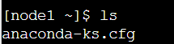
## Iniciar el cluster
El primer paso es inicializar el clúster en la primera terminal:

  ```kubeadm init --apiserver-advertise-address $(hostname -i)```
  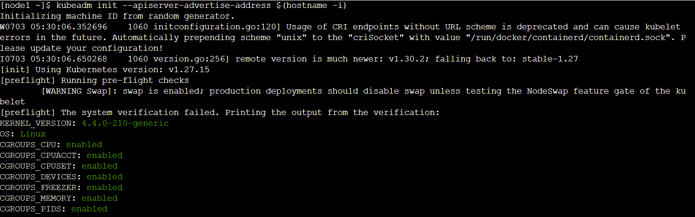

Esto tomará un par de minutos, durante los cuales verá mucha actividad en la terminal.

Verás algo como esto al final:

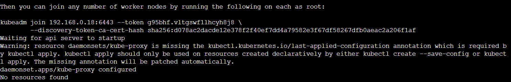

Copia toda la línea que comienza kubeadm joinen la primera terminal y pégala en la segunda. Deberías ver algo como esto:


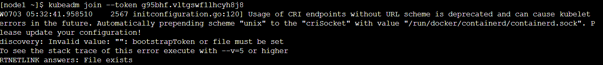
Eso significa que ya casi estás listo para empezar. Por último, solo tienes que inicializar la red del clúster en la primera terminal:

   ```kubectl apply -n kube-system -f \
    "https://cloud.weave.works/k8s/net?k8s-version=$(kubectl version | base64 |tr -d '\n')"
  ```

Verás un resultado como este:

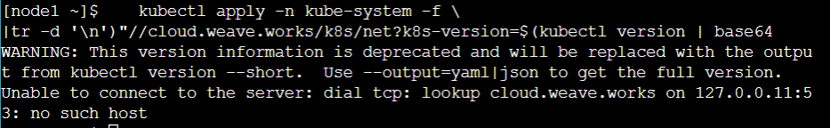

¡Tu cluster está configurado!

## ¿Qué es esta aplicación?
- ¡Es un minero de DockerCoin! 💰🐳📦🚢

- No, no puedes comprar café con DockerCoins

- Cómo funcionan las DockerCoins:

  - workerpide rnggenerar algunos bytes aleatorios

  - workerintroduce estos bytes enhasher

  - ¡y repetir para siempre!

  - Cada segundo, workerse actualiza redispara indicar cuántos bucles se realizaron.

  - webuiconsultas redis, calcula y expone la "velocidad de hash" en su navegador

## Obtener el código fuente de la aplicación
Hemos creado una aplicación de muestra para ejecutar en partes del taller. La aplicación se encuentra en el repositorio de dockercoins .

Veamos el diseño general del código fuente:

Hay un archivo Compose ```docker-compose.yml…```

…y otros 4 servicios, cada uno en su propio directorio:

```rng```= servicio web que genera bytes aleatorios

```hasher```= servicio web que calcula el hash de los datos publicados

```worker```= proceso en segundo plano que utiliza rngyhasher

```webui```= Interfaz web para ver el progreso.

- Clonaremos el repositorio de GitHub

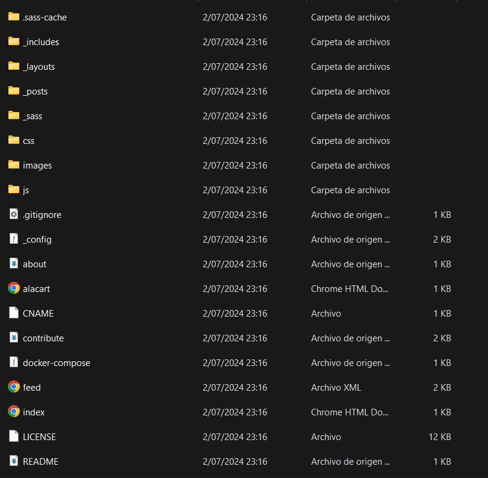

- El repositorio también contiene scripts y herramientas que usaremos durante el taller.

  ```git clone https://github.com/dockersamples/dockercoins```

  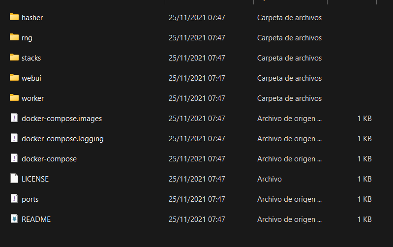

(También puedes bifurcar el repositorio en GitHub y clonar tu bifurcación si lo prefieres).

## Ejecutando la aplicación
- Vaya al directorio dockercoins, en el repositorio clonado:

  ```cd ~/dockercoins```

  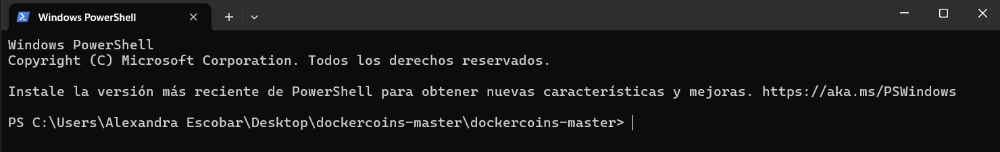

- Utilice Compose para crear y ejecutar todos los contenedores:

  ```docker-compose up```
  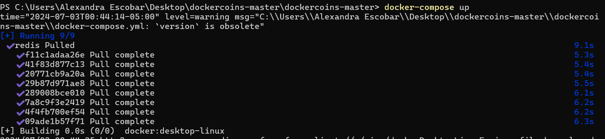

Compose le dice a Docker que construya todas las imágenes de contenedores (extrayendo las imágenes base correspondientes), luego inicia todos los contenedores y muestra registros agregados.

Muchos registros
- La aplicación genera registros continuamente

- Podemos ver el servicio de trabajo haciendo solicitudes a rng y hasher

- Dejemos eso en segundo plano.

## Conexión a la interfaz web
- El webui contenedor expone un panel web; veámoslo

- Con un navegador web, conéctese node1 aquí en el puerto 8000 (creado cuando ejecutó la aplicación)

  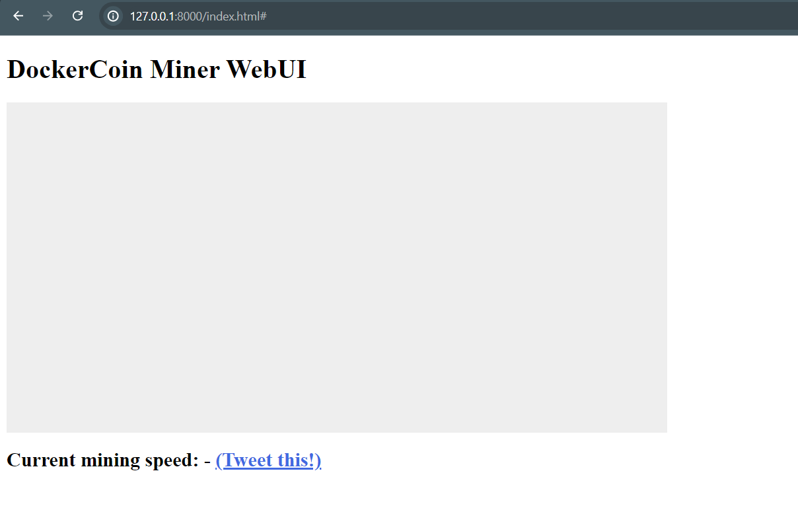

## Limpiar
- Antes de continuar, apaguemos todo escribiendo Ctrl-C.
  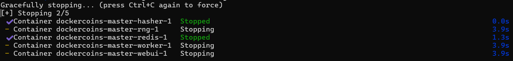
## Conceptos de Kubernetes
- Kubernetes es un sistema de gestión de contenedores

- Ejecuta y administra aplicaciones en contenedores en un clúster.

- ¿Qué significa eso realmente?

## Cosas básicas que podemos pedirle a Kubernetes que haga
- Iniciar 5 contenedores usando la image natseashop/api:v1.3

- Coloque un balanceador de carga interno frente a estos contenedores

- Iniciar 10 contenedores usando la imagenatseashop/webfront:v1.3

- Coloque un balanceador de carga público frente a estos contenedores

- Es Viernes Negro (o Navidad), picos de tráfico, hacemos crecer nuestro clúster y agregamos contenedores

- ¡Nuevo lanzamiento! Reemplace mis contenedores con la nueva imagenatseashop/webfront:v1.4

- Seguir procesando solicitudes durante la actualización; actualizar mis contenedores uno a la vez

## Otras cosas que Kubernetes puede hacer por nosotros
- Escalado automático básico

- Implementación azul/verde, implementación canaria

- Servicios de larga duración, pero también trabajos por lotes (únicos)

- Sobrecargar nuestro clúster y desalojar trabajos de baja prioridad

- Ejecutar servicios con datos con estado (bases de datos, etc.)

- Control de acceso detallado que define qué puede hacer cada persona y en qué recursos

- Integración de servicios de terceros (catálogo de servicios)

- Automatización de tareas complejas (operadores)

## Arquitectura de Kubernetes
### Arquitectura de Kubernetes: el maestro
- La lógica de Kubernetes (su “cerebro”) es una colección de servicios:

  - el servidor API (¡nuestro punto de entrada a todo!)
  - Servicios básicos como el programador y el administrador del controlador.
  - etcd (un almacén de claves y valores de alta disponibilidad; la “base de datos” de Kubernetes)
*En conjunto, estos servicios forman lo que se denomina el “maestro”

- Estos servicios pueden ejecutarse directamente en un host o en contenedores (ese es un detalle de implementación).

- etcd se puede ejecutar en máquinas separadas (primer esquema) o en el mismo lugar (segundo esquema)

- Necesitamos al menos un maestro, pero podemos tener más (para alta disponibilidad)

## Arquitectura de Kubernetes: los nodos
- Los nodos que ejecutan nuestros contenedores ejecutan otra colección de servicios:

  - Un motor de contenedores (normalmente Docker)
  - kubelet (el “agente de nodo”)
  - kube-proxy (un componente de red necesario pero no suficiente)
- Los nodos antes se llamaban “minions”

- Es habitual no ejecutar aplicaciones en los nodos que ejecutan componentes maestros (excepto cuando se utilizan pequeños clústeres de desarrollo)

## Recursos de Kubernetes
- La API de Kubernetes define una gran cantidad de objetos llamados recursos

- Estos recursos están organizados por tipo o Kind (en la API)

- Algunos tipos de recursos comunes son:

  - nodo (una máquina, física o virtual, en nuestro clúster)
  - pod (grupo de contenedores que se ejecutan juntos en un nodo)
  - servicio (punto final de red estable para conectarse a uno o varios contenedores)
  - espacio de nombres (grupo de cosas más o menos aislado)
  - secreto (conjunto de datos confidenciales que se pasarán a un contenedor)
- ¡Y mucho más! (Podemos ver la lista completa ejecutando kubectl get)

## Declarativo vs imperativo
- Nuestro orquestador de contenedores pone mucho énfasis en ser declarativo

- Declarativo:

      me gustaría una taza de té.

- Imperativo:

      Hierve un poco de agua. Viértela en una tetera. Añade hojas de té. Deja reposar un rato. Sirve en una taza.

- El declarativo parece más simple al principio…

- … Siempre que sepas preparar té

### Lo que realmente sería declarativo:
Quiero una taza de té, obtenida vertiendo una infusión de hojas de té en una taza.

Se obtiene una infusión dejando el objeto en remojo unos minutos en agua caliente.

El líquido caliente se obtiene vertiéndolo en un recipiente apropiado y poniéndolo sobre el fuego.

¡Ah, por fin, contenedores! Algo que ya conocemos. ¡Manos a la obra!

## Resumen de declarativo vs imperativo
- Sistemas imperativos:

  - Más simple

  - Si una tarea se interrumpe, tenemos que reiniciarla desde cero

- Sistemas declarativos:

  - Si se interrumpe una tarea (o si llegamos a la fiesta a mitad de camino), podemos averiguar qué falta y hacer solo lo necesario.

  - Necesitamos poder observar el sistema

  - …y calcular una “diferencia” entre lo que tenemos y lo que queremos

## Declarativo vs imperativo en Kubernetes
- Prácticamente todo lo que creamos en Kubernetes se crea a partir de unspec

- ¡Esté atento a los speccampos en los archivos YAML más tarde!

- El specdescribe cómo queremos que sea la cosa.

- Kubernetes conciliará el estado actual con la especificación (técnicamente, esto lo hacen varios controladores )

- Cuando queremos cambiar algún recurso, actualizamos elspec

- Kubernetes luego convergerá ese recurso.

## Modelo de red de Kubernetes
- Resumen:

  - Nuestro clúster (nodos y pods) es una gran red IP plana.

- En detalle:

  - Todos los nodos deben poder comunicarse entre sí, sin NAT.

  - Todos los pods deben poder comunicarse entre sí, sin NAT

  - Los pods y los nodos deben poder comunicarse entre sí, sin NAT

  - Cada pod conoce su dirección IP (sin NAT)

- Kubernetes no exige ninguna implementación en particular

## Modelo de red de Kubernetes: lo bueno
- Todo puede alcanzar todo.

- Sin traducción de dirección

- Sin traducción de puerto

- No hay nuevo protocolo

- Los pods no pueden moverse de un nodo a otro y mantener su dirección IP

- Las direcciones IP no tienen que ser “portables” de un nodo a otro (podemos usar, por ejemplo, una subred por nodo y utilizar una topología enrutada simple)

- La especificación es lo suficientemente simple como para permitir muchas implementaciones diferentes.

## Modelo de red de Kubernetes: lo menos bueno
- Todo puede alcanzar todo.

  - Si quieres seguridad, necesitas agregar políticas de red.

  - La implementación de red que utilice debe admitirlos.

- Existen literalmente docenas de implementaciones (15 están enumeradas en la documentación de Kubernetes)

- Parece que tienes una red de nivel 3, pero solo es de nivel 4 (la especificación requiere UDP y TCP, pero no rangos de puertos ni paquetes IP arbitrarios)

- kube-proxyestá en la ruta de datos cuando se conecta a un pod o contenedor, y no es particularmente rápido (depende del proxy del espacio de usuario o de iptables)

## Modelo de red de Kubernetes: en la práctica
- Los nodos que estamos utilizando se han configurado para utilizar Weave

- No respaldamos a Weave de ninguna manera en particular, simplemente funciona para nosotros

- No te preocupes por la advertencia sobre el rendimiento de kube-proxy

- A menos que usted:

  - saturar rutinariamente las interfaces de red 10G

  - contar las tasas de paquetes en millones por segundo

  - Ejecutar plataformas de juegos o VOIP de alto tráfico

  - hacer cosas raras que involucran millones de conexiones simultáneas (en cuyo caso ya estás familiarizado con el ajuste del kernel)

## Primer contacto conkubectl
- kubectles (casi) la única herramienta que necesitaremos para comunicarnos con Kubernetes

- Es una herramienta CLI rica en torno a la API de Kubernetes (todo lo que puede hacer con kubectl, puede hacerlo directamente con la API)

- También puedes usar la --kubeconfigbandera para pasar un archivo de configuración

- O directamente --server, --user, etc.

- kubectlse puede pronunciar “Cube CTL”, “Cube cuttle”, “Cube cuddle”…

## kubectl get
- ¡Veamos nuestros recursos de Node con kubectl get!

- Observa la composición de nuestro cluster:

  ```kubectl get node```

  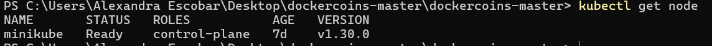


- Estos comandos son equivalentes
  ```
  kubectl get no
  kubectl get node
  kubectl get nodes
  ```
  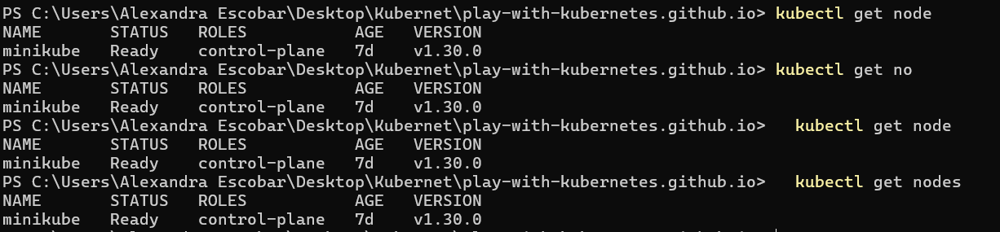
## Obtención de una salida legible por máquina
- kubectl getPuede generar JSON, YAML o formatearse directamente.

- Danos más información sobre los nodos:

  ```kubectl get nodes -o wide```
  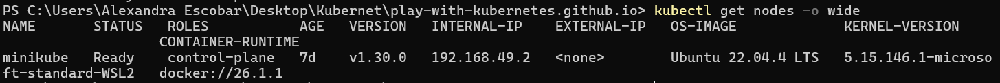

- Vamos a tener algo de YAML:

  ```kubectl get no -o yaml```
  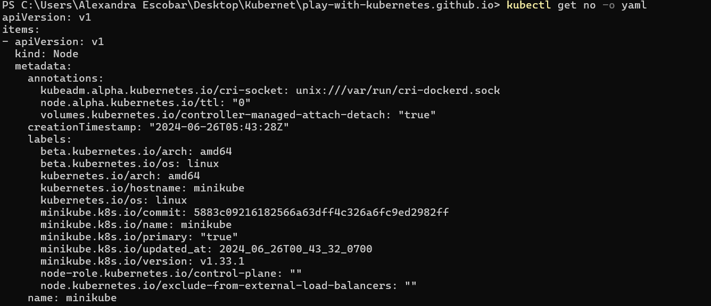

   ¿Ves ese tipo de lista al final? ¡Es el tipo de nuestro resultado!

## (Ab)usar kubectlyjq
Es muy fácil crear informes personalizados

Muestra la capacidad de todos nuestros nodos como un flujo de objetos JSON:

kubectl get nodes -o json |
      jq ".items[] | {name:.metadata.name} + .status.capacity"
## ¿Que hay disponible?
kubectlTiene muy buenas instalaciones de introspección.

Podemos enumerar todos los tipos de recursos disponibles ejecutandokubectl get

Podemos ver detalles sobre un recurso con:
kubectl describe type/name
kubectl describe type name
Podemos ver la definición de un tipo de recurso con:
kubectl explain type
Cada vez, typeel nombre puede ser singular, plural o abreviado.

## Servicios
Un servicio es un punto final estable para conectarse a “algo” (en la propuesta inicial se llamaban “portales”)

Enumere los servicios en nuestro clúster:

kubectl get services
Esto también funcionaría:

    kubectl get svc
Ya hay un servicio en nuestro clúster: la propia API de Kubernetes.

## Servicios de ClusterIP
Un ClusterIPservicio es interno y solo está disponible desde el clúster.

Esto es útil para la introspección desde dentro de los contenedores.

Intente conectarse a la API.

-kse utiliza para omitir la verificación del certificado
Asegúrese de reemplazar 10.96.0.1 con el CLUSTER-IP que se muestra en$ kubectl get svc
curl -k https://10.96.0.1
El error que vemos es el esperado: la API de Kubernetes requiere autenticación.

## Listado de contenedores en funcionamiento
Los contenedores se manipulan a través de pods.

Un pod es un grupo de contenedores:

corriendo juntos (en el mismo nodo)

compartir recursos (RAM, CPU; pero también red, volúmenes)

Lista de pods en nuestro clúster:

kubectl get pods
Estas no son las cápsulas que estás buscando . ¿Pero dónde están?

## Espacios de nombres
Los espacios de nombres nos permiten segregar recursos

Enumere los espacios de nombres en nuestro clúster con uno de estos comandos:

kubectl get namespaces
Cualquiera de estos también funcionaría:

kubectl get namespace
kubectl get ns
¿Sabes qué? Esta kube-systemcosa parece sospechosa.

## Acceder a espacios de nombres
De forma predeterminada, kubectlutiliza el defaultespacio de nombres

Podemos cambiar a un espacio de nombres diferente con la -nopción

Enumere los pods en el kube-systemespacio de nombres:

kubectl -n kube-system get pods
¡Ding, ding, ding, ding!

## ¿Qué son todas estas vainas?
etcd¿Es nuestro servidor etcd?

kube-apiserveres el servidor API

kube-controller-managery kube-schedulerson otros componentes maestros

kube-dnses un componente adicional (no obligatorio pero súper útil, por eso está ahí)

kube-proxyes el componente (por nodo) que administra las asignaciones de puertos y demás

weavees el componente (por nodo) que administra la superposición de la red
La READYcolumna indica el número de contenedores en cada pod.

Los pods con un nombre que termina en -node1son los componentes maestros (han sido específicamente "anclados" al nodo maestro)

## Ejecutando nuestros primeros contenedores en Kubernetes
Lo primero es lo primero: no podemos ejecutar un contenedor

Vamos a ejecutar un pod, y en ese pod habrá un solo contenedor.

En ese contenedor del pod, vamos a ejecutar un comando ping simple

Luego vamos a iniciar copias adicionales del pod.

## Iniciando un pod simple conkubectl run
Necesitamos especificar al menos un nombre y la imagen que queremos utilizar.

Hagamos ping al 8.8.8.8DNS público de Google

kubectl run pingpong --image alpine ping 8.8.8.8
Bueno, ¿qué acaba de pasar?

## Entre bastidores dekubectl run
Veamos los recursos que fueron creados porkubectl run

Enumere la mayoría de los tipos de recursos:

kubectl get all
Deberíamos ver las siguientes cosas:

deploy/pingpong(la implementación que acabamos de crear)
rs/pingpong-xxxx(un conjunto de réplicas creado por la implementación)
po/pingpong-yyyy(una cápsula creada por el conjunto de réplicas)
## ¿Qué son estas cosas diferentes?
Una implementación es una construcción de alto nivel

Permite escalar, realizar actualizaciones y reversiones.

Se pueden usar varias implementaciones juntas para implementar una implementación canaria

delega la gestión de pods a conjuntos de réplicas

Un conjunto de réplicas es una construcción de bajo nivel.

se asegura de que se esté ejecutando una cantidad determinada de pods idénticos

permite escalar

rara vez se utiliza directamente

Un controlador de replicación es el predecesor (obsoleto) de un conjunto de réplicas

## Nuestro pingpongdespliegue
kubectl runcreó una implementación ,deploy/pingpong

Esa implementación creó un conjunto de réplicas ,rs/pingpong-xxxx

Ese conjunto de réplicas creó una cápsula ,po/pingpong-yyyy

Veremos más adelante cómo juegan juntos estos chicos:

escalada

alta disponibilidad

actualizaciones continuas

## Visualización de la salida del contenedor
Vamos a utilizar el kubectl logscomando

Pasaremos un nombre de pod o un tipo/nombre (por ejemplo, si especificamos un conjunto de implementación o réplica, obtendrá el primer pod que contenga).

A menos que se especifique lo contrario, solo se mostrarán los registros del primer contenedor en el pod (¡menos mal que solo hay uno en el nuestro!).

Vea el resultado de nuestro comando ping:

kubectl logs deploy/pingpong
## Registros de transmisión en tiempo real
Al igual que docker logs, kubectl logsadmite opciones convenientes:

-f/--followpara transmitir registros en tiempo real (a la tail -f)

--tailpara indicar cuántas líneas quieres ver (desde el final)

--sincePara obtener registros solo después de una marca de tiempo determinada

Ver los últimos registros de nuestro comando ping:

kubectl logs deploy/pingpong --tail 1 --follow
## Escalando nuestra aplicación
Podemos crear copias adicionales de nuestro contenedor (o más bien de nuestro pod) conkubectl scale

Escale nuestra implementación de pingpong:

kubectl scale deploy/pingpong --replicas 8
Nota: ¿Qué sucedería si intentáramos escalar rs/pingpong-xxxx? ¡Podríamos! Pero la implementación lo detectaría de inmediato y volvería al nivel inicial.

## Resiliencia
El pingpong de despliegue vigila su conjunto de réplicas

El conjunto de réplicas garantiza que se esté ejecutando la cantidad correcta de pods

## ¿Qué pasa si las vainas desaparecen?

En una ventana separada, enumera los pods y continúa observándolos:
kubectl get pods -w
Ctrl-Cpara terminar de mirar.

Si quisieras destruir un pod, usarías este patrón donde yyyyestaba el identificador del pod en particular:
kubectl delete pod pingpong-yyyy
¿Qué pasaría si quisiéramos algo diferente?
¿Qué pasa si queremos iniciar un contenedor “one-shot” que no se reinicia?

Podríamos utilizar kubectl run --restart=OnFailureokubectl run --restart=Never

Estos comandos crearían trabajos o pods en lugar de implementaciones.

Bajo el capó, kubectl runinvoca “generadores” para crear descripciones de recursos

También podríamos escribir estas descripciones de recursos nosotros mismos (normalmente en YAML) y crearlas en el clúster con kubectl apply -f(se analiza más adelante)

Con kubectl run --schedule=…, también podemos crear cronjobs

## Visualización de registros de varios pods
Cuando especificamos un nombre de implementación, solo se muestran los registros de un solo pod

Podemos ver los registros de varios pods especificando un selector

Un selector es una expresión lógica que utiliza etiquetas.

Convenientemente, cuando you kubectl run somename, los objetos asociados tienen una run=somenameetiqueta

Ver la última línea del registro de todos los pods con la run=pingpongetiqueta:

kubectl logs -l run=pingpong --tail 1
Lamentablemente, --followno se puede usar (todavía) para transmitir los registros desde múltiples contenedores.

## Limpiar
Limpia tu implementación eliminandopingpong

kubectl delete deploy/pingpong
## Exponiendo contenedores
kubectl exposeCrea un servicio para pods existentes.

Un servicio es una dirección estable para un pod (o un grupo de pods)

Si queremos conectarnos a nuestro(s) pod(es), necesitamos crear un servicio

Una vez que se crea un servicio, kube-dnsnos permitirá resolverlo por nombre (es decir, después de crear el servicio hello, el nombre hellose resolverá en algo)

Existen diferentes tipos de servicios, detallados en las siguientes diapositivas:

ClusterIP, NodePort, LoadBalancer,ExternalName

Tipos de servicios básicos
ClusterIP(tipo predeterminado)

Se asigna una dirección IP virtual para el servicio (en un rango interno privado). Esta dirección IP solo es accesible desde dentro del clúster (nodos y pods). Nuestro código puede conectarse al servicio usando el número de puerto original.

NodePort

se asigna un puerto para el servicio (por defecto, en el rango 30000-32768) ese puerto está disponible en todos nuestros nodos y cualquiera puede conectarse a él nuestro código debe cambiarse para conectarse a ese nuevo número de puerto

Estos tipos de servicios están siempre disponibles.

Bajo el capó: kube-proxyse utiliza un proxy de usuario y un montón de iptablesreglas.

## Más tipos de servicios
LoadBalancer
Se asigna un balanceador de carga externo para el servicio
El balanceador de carga se configura en consecuencia (por ejemplo: NodePortse crea un servicio y el balanceador de carga envía tráfico a ese puerto)
ExternalName

La entrada DNS administrada por kube-dnsserá solo una CNAMEpara un registro proporcionado
No se asigna ningún puerto, ninguna dirección IP ni nada más
## Ejecución de contenedores con puertos abiertos
Dado que ping no tiene nada a lo que conectarse, tendremos que ejecutar algo más.

Inicie un grupo de contenedores ElasticSearch:
kubectl run elastic --image=elasticsearch:2 --replicas=4
Mira como empiezan:

kubectl get pods -w
La -wopción “observa” los eventos que suceden en los recursos especificados.

Nota: NO llame al servicio search. Esto podría entrar en conflicto con el TLD.

## Exponiendo nuestro despliegue
Crearemos un ClusterIPservicio predeterminado

Exponer el puerto API HTTP de ElasticSearch:

kubectl expose deploy/elastic --port 9200
Busque qué dirección IP fue asignada:

kubectl get svc
## Los servicios son construcciones de capa 4
Puedes asignar direcciones IP a los servicios, pero siguen siendo de capa 4 (es decir, un servicio no es una dirección IP; es una dirección IP + protocolo + puerto).

Esto se debe a la implementación actual de kube-proxy(se basa en mecanismos que no admiten la capa 3)

Como resultado: debes indicar el número de puerto para tu servicio

La ejecución de servicios con un puerto arbitrario (o rangos de puertos) requiere modificaciones (por ejemplo, el modo de red del host)

## Probando nuestro servicio
Ahora enviaremos algunas solicitudes HTTP a nuestros pods ElasticSearch

Obtengamos la dirección IP que fue asignada para nuestro servicio, programáticamente :

IP=$(kubectl get svc elastic -o go-template --template '{{ .spec.clusterIP }}')
Envíe algunas solicitudes:

curl http://$IP:9200/
Nuestras solicitudes se equilibran entre múltiples pods.

## Limpiar
Hemos terminado con la elasticimplementación, así que vamos a limpiarla.

kubectl delete deploy/elastic
# Nuestra aplicación en Kube
## ¿Que hay en el menu?
En esta parte:

Crea imágenes para nuestra aplicación,

Envía estas imágenes con un registro,

ejecutar implementaciones utilizando estas imágenes,

Exponer estas implementaciones para que puedan comunicarse entre sí,

Exponer la interfaz web para que podamos acceder a ella desde el exterior.

## El plan
Construir sobre nuestro nodo de control ( node1)

Etiqueta las imágenes para que tengan nombre$USERNAME/servicename

Subirlos a un Docker Hub

Crear implementaciones utilizando las imágenes

Exponer (con un ClusterIP) los servicios que necesitan comunicarse

Exponer (con un NodePort) la interfaz web

## Configuración
En la primera terminal, configure una variable de entorno para su nombre de usuario de Docker Hub . Puede ser el mismo nombre de usuario de Docker Hub que utilizó para iniciar sesión en las terminales de este sitio.

export USERNAME=YourUserName
Asegúrate de que todavía estás en el dockercoinsdirectorio.

pwd
## Una nota sobre los registros
Para este taller, utilizaremos Docker Hub . Hay otras opciones, incluidas dos proporcionadas por Docker.

Docker también proporciona:

Docker Trusted Registry , que agrega muchas funciones de seguridad e implementación, incluido escaneo de seguridad y control de acceso basado en roles.
Registro de código abierto de Docker .
## Centro Docker
Docker Hub es el registro predeterminado para Docker.

Los nombres de las imágenes en Hub son simplemente $USERNAME/$IMAGENAMEo $ORGANIZATIONNAME/$IMAGENAME.

Las imágenes oficiales se pueden denominar simplemente $IMAGENAME.

Para utilizar Hub, asegúrese de tener una cuenta. Luego, ingrese docker logina la terminal e inicie sesión con su nombre de usuario y contraseña.

Al utilizar Docker Trusted Registry, Docker Open Source Registry es muy similar.

Los nombres de imágenes en otros registros son $REGISTRYPATH/$USERNAME/$IMAGENAMEo $REGISTRYPATH/$ORGANIZATIONNAME/$IMAGENAME.

Iniciar sesión usando docker login $REGISTRYPATH.

## Construyendo y potenciando nuestras imágenes
Vamos a utilizar una característica conveniente de Docker Compose

Ir al stacksdirectorio:

cd ~/dockercoins/stacks
Construye y envía las imágenes:

docker-compose -f dockercoins.yml build
docker-compose -f dockercoins.yml push
Echemos un vistazo al archivo dockercoins.yml mientras se compila y se envía.

version: "3"
services:
  rng:
    build: dockercoins/rng
    image: ${USERNAME}/rng:${TAG-latest}
    deploy:
      mode: global
  ...
  redis:
    image: redis
  ...
  worker:
    build: dockercoins/worker
    image: ${USERNAME}/worker:${TAG-latest}
    ...
    deploy:
      replicas: 10
Por si acaso te lo estabas preguntando… Los “servicios” de Docker no son “servicios” de Kubernetes.

## Desplegando todas las cosas
Ahora podemos implementar nuestro código (así como una instancia de redis)

Desplegar redis:

kubectl run redis --image=redis
Implementar todo lo demás:

for SERVICE in hasher rng webui worker; do
  kubectl run $SERVICE --image=$USERNAME/$SERVICE -l app=$SERVICE
done
## ¿Esto funciona?
Después de esperar a que se complete la implementación, ¡veamos los registros!

(Sugerencia: úselo kubectl get deploy -wpara observar eventos de implementación)

Mira algunos registros:

kubectl logs deploy/rng
kubectl logs deploy/worker
🤔 rngestá bien… Pero no worker.

💡 ¡Ah, cierto! Nos olvidamos de expose.

# Servicios de exposición
## Exponer servicios internamente
Tres implementaciones deben ser accesibles para otros: hasher, redis,rng

workerNo necesita ser expuesto

webuiSe tratará más adelante

Exponer cada implementación, especificando el puerto correcto:

kubectl expose deployment redis --port 6379
kubectl expose deployment rng --port 80
kubectl expose deployment hasher --port 80
## ¿Esto ya funciona?
Tiene workerun bucle infinito, que vuelve a intentarlo 10 segundos después de un error.

Transmitir los registros del trabajador:

kubectl logs deploy/worker --follow
(Dale unos 10 segundos para que se recupere)

Ahora deberíamos verlo worker, bueno, funcionando felizmente.
## Exponer servicios para acceso externo
Ahora nos gustaría acceder a la interfaz web.

Lo expondremos con un NodePort(tal como lo hicimos para el registro)

Crear un NodePortservicio para la interfaz web:

kubectl create service nodeport webui --tcp=80 --node-port=30001
Verifique el puerto que fue asignado:

kubectl get svc
## Acceder a la interfaz web
Ahora podemos conectarnos a cualquier nodo , en el puerto de nodo asignado, para ver la interfaz de usuario web.
Haga clic en este enlace

¡Muy bien, volvemos al punto de partida, cuando estábamos funcionando en un solo nodo!

# Implicaciones de seguridad dekubectl apply
Cuando lo hacemos kubectl apply -f <URL>, creamos recursos arbitrarios.

Los recursos pueden ser malos; imagina deploymenteso…

inicia mineros de bitcoin en todo el clúster

se oculta en un espacio de nombres no predeterminado

bind monta el sistema de archivos de nuestros nodos

inserta claves SSH en la cuenta raíz (en el nodo)

Encripta nuestros datos y pide rescate por ellos

☠️☠️☠️

## kubectl applyEs el nuevocurl | sh
curl | shes conveniente

Es seguro si utiliza URL HTTPS de fuentes confiables

kubectl apply -fes conveniente

Es seguro si utiliza URL HTTPS de fuentes confiables

Introduce nuevos modos de fallo

Ejemplo: las instrucciones de configuración oficiales para la mayoría de las redes de pods

## Escalar una implementación
Comenzaremos con uno fácil: el workerdespliegue.

kubectl get pods

kubectl get deployments
Ahora, crea más workerréplicas:

kubectl scale deploy/worker --replicas=10
Después de unos segundos, debería aparecer el gráfico en la interfaz web (y alcanzar un máximo de 10 hashes por segundo, tal como cuando estábamos trabajando en uno solo).

## Conjuntos de demonios
¿Qué pasa si queremos una (y exactamente una) instancia de rng por nodo?

Si simplemente escalamos la implementación/rng a 2, nada garantiza que se propaguen.

En lugar de una implementación, utilizaremos un daemonset

Los conjuntos de demonios son excelentes para procesos por nodo y a nivel de clúster:

proxy kube
tejido (nuestra red superpuesta)
agentes de vigilancia
herramientas de gestión de hardware (por ejemplo, agentes HBA SCSI/FC)
etc.
También se pueden restringir para que se ejecuten sólo en algunos nodos .

## Creando un conjunto de demonios
Lamentablemente, a partir de Kubernetes 1.9, la CLI no puede crear conjuntos de demonios

Más precisamente: no tiene un subcomando para crear un conjunto de demonios.

Pero siempre se puede crear cualquier tipo de recurso proporcionando una descripción YAML:

kubectl apply -f foo.yaml
¿Cómo creamos el archivo YAML para nuestro conjunto de demonios?

Opción 1: leer los documentos
Opción 2: vinuestra salida
## Creando el archivo YAML para nuestro conjunto de demonios
Comencemos con el archivo YAML para el rngrecurso actual

Volcar el recurso rng en YAML:

kubectl get deploy/rng -o yaml --export >rng.yml
Editarrng.yml

Nota: --exporteliminará la información “específica del clúster”, es decir:

espacio de nombres (para que el recurso no esté vinculado a un espacio de nombres específico) estado y marca de tiempo de creación (inútil al crear un nuevo recurso) resourceVersion y uid (estos causarían… problemas interesantes )

## “Transmitir” un recurso a otro
¿Qué pasaría si simplemente cambiáramos el kindcampo?

(No puede ser tan fácil ¿verdad?)

Cambiar kind: Deploymentakind: DaemonSet

Guardar, salir

Intenta crear nuestro nuevo recurso:

  kubectl apply -f rng.yml
Todos sabíamos que esto no podía ser tan fácil, ¿verdad?
## Entendiendo el problema
El núcleo del error es:

error validating data:
[ValidationError(DaemonSet.spec):
unknown field "replicas" in io.k8s.api.extensions.v1beta1.DaemonSetSpec,
...
Obviamente , no tiene sentido especificar un número de réplicas para un conjunto de demonios.

Solución alternativa: arregle el YAML

eliminar el replicascampo
eliminar el strategycampo (que define el mecanismo de implementación para una implementación)
eliminar la status: {}linea al final
O también podríamos…

## Utilice el --force, Lucas
También podríamos decirle a Kubernetes que ignore estos errores e intente de todos modos.

El --forcenombre real de la bandera es--validate=false

Intente cargar nuestro archivo YAML e ignore los errores:

kubectl apply -f rng.yml --validate=false
Usa –force, Luke También podríamos decirle a Kubernetes que ignore estos errores e intente de todos modos

El nombre real del indicador –force es –validate=false

Intenta cargar nuestro archivo YAML e ignora los errores: kubectl apply -f rng.yml –validate=false 🎩✨🐇

Espera… ¿ puede ser tan fácil?

## Comprobando lo que hemos hecho
¿Hemos transformado nuestro deploymenten un daemonset?

Mire los recursos que tenemos ahora:

kubectl get all
¡Tenemos ambos deploy/rngy ds/rngahora!

Y una vaina de más…

## Explicación
Puede tener diferentes tipos de recursos con el mismo nombre (es decir, una implementación y un conjunto de demonios, ambos denominados rng)

Todavía tenemos el antiguo rng despliegue

Pero ahora también tenemos el nuevo rng conjunto de demonios.

Si observamos las vainas, tenemos:

una cápsula para el despliegue
un pod por nodo para el conjunto de demonios
## ¿Qué están haciendo todas estas cápsulas?
Revisemos los registros de todos estos rngpods.

Todas estas cápsulas tienen una run=rngetiqueta:

la primera vaina, porque eso es lo que kubectl runhace
los otros (en el conjunto de demonios), porque copiamos la especificación del primero
Por lo tanto, podemos consultar los registros de todos usando ese run=rngselector.

Verifique los registros de todos los pods que tengan una etiqueta run=rng:

kubectl logs -l run=rng --tail 1
Parece que todos los pods están atendiendo solicitudes en este momento.

## Eliminar el primer pod del balanceador de carga
¿Qué pasaría si quitáramos esa vaina, con kubectl delete pod ...?

El conjunto de réplicas lo recrearía inmediatamente.

¿Qué pasaría si quitáramos la run=rngetiqueta de esa cápsula?

Lo replicasetrecrearían inmediatamente.

…Porque lo que importa replicasetes el número de pods que coinciden con ese selector .

Pero pero pero… ¿No tenemos más de una cápsula run=rngahora?

La respuesta está en el selector exacto utilizado por replicaset…

## Profundización en los selectores
Veamos los selectores para la rng implementación y el conjunto de réplicas asociado.

Mostrar información detallada sobre la rngimplementación:

kubectl describe deploy rng
Mostrar información detallada sobre la rngréplica:

kubectl describe rs rng-yyyy
El selector del conjunto de réplicas también tiene un pod-template-hash, a diferencia de los pods en nuestro conjunto de demonios.

# Actualización de un servicio mediante etiquetas y selectores
¿Qué pasa si queremos eliminar la rngimplementación del balanceador de carga?

Opción 1:

destruyelo
Opcion 2:

## Agregar una etiqueta adicional al conjunto de demonios
Actualice el selector de servicio para hacer referencia a esa etiqueta
Por supuesto, la opción 2 ofrece más oportunidades de aprendizaje, ¿verdad?

Agregar una etiqueta adicional al conjunto de demonios
Actualizaremos el conjunto de demonios “spec”

Opción 1:

Edita el rng.ymlarchivo que usamos anteriormente.
cargar la nueva definición conkubectl apply
Opcion 2:

usarkubectl edit
Si crees que ya lo has logrado, no dudes en intentarlo directamente. ¡Hemos incluido algunos consejos en las siguientes diapositivas para tu comodidad!

## Hemos puesto recursos en sus recursos.
Recordatorio: ¡un conjunto de demonios es un recurso que crea más recursos!

Hay una diferencia entre:

la(s) etiqueta(s) de un recurso (en el metadatabloque al principio)
el selector de un recurso (en el specbloque)
las etiquetas de los recursos creados por el primer recurso (en el templatebloque)
Debe actualizar el selector y la plantilla (las etiquetas de metadatos no son obligatorias)

La plantilla debe coincidir con el selector (es decir, el recurso se negará a crear recursos que no seleccione)

## Añadiendo nuestra etiqueta
Vamos a añadir una etiquetaisactive: yes

En YAML, sí debe ir entre comillas; es decirisactive: "yes"

Actualice el conjunto de demonios para agregarlo isactive: "yes"al selector y a la etiqueta de plantilla:

kubectl edit daemonset rng
spec:
  revisionHistoryLimit: 10
  selector:
    matchLabels:
      app: rng      
      isactive: "yes"
  template:
    metadata:
      creationTimestamp: null
      labels:
        app: rng      
        isactive: "yes"
Actualice el servicio para agregarlo isactive: "yes"a su selector:

kubectl edit service rng
## Comprobando lo que hemos hecho
Verifique los registros de todos run=rnglos pods para confirmar que solo 2 de ellos estén activos ahora:

kubectl logs -l run=rng
Las marcas de tiempo deberían darnos una pista sobre cuántos pods están recibiendo tráfico actualmente.

Mira las vainas que tenemos ahora mismo:

kubectl get pods
## ¿Más etiquetas, más selectores, más problemas?
Ejercicio extra 1: limpia los pods del conjunto de demonios “antiguo”

Ejercicio extra 2: ¿Cómo podríamos haber hecho esto para evitar la creación de nuevos pods?

## Actualizaciones continuas
De forma predeterminada (sin actualizaciones continuas), cuando se actualiza un recurso escalado:

Se crean nuevos pods
Las vainas antiguas se terminan
… todo al mismo tiempo
Si algo sale mal, ¯_(ツ)_/¯
Con actualizaciones continuas, cuando se actualiza un recurso, esto sucede progresivamente.

Dos parámetros determinan el ritmo del despliegue: maxUnavailableymaxSurge

Se pueden especificar en número absoluto de pods o en porcentaje del replicasrecuento .

En cualquier momento dado …

Siempre habrá al menos replicas- maxUnavailablevainas disponibles
Nunca habrá más de replicas+ maxSurgepods en total
Por lo tanto, habrá hasta maxUnavailable+ maxSurgepods que se actualizarán
Tenemos la posibilidad de volver a la versión anterior (si la actualización falla o no es satisfactoria de alguna manera)

## Actualizaciones continuas en la práctica
A partir de Kubernetes 1.8, podemos realizar actualizaciones continuas con:

deployments, daemonsets,statefulsets

La edición de uno de estos recursos dará como resultado automáticamente una actualización continua.

Las actualizaciones continuas se pueden monitorear con el kubectl rolloutsubcomando

## Construyendo una nueva versión del workerservicio
Editar dockercoins/worker/worker.py, actualizar la línea de sueño para dormir 1 segundo

Ir al directorio de la pila:

cd stacks
Crea una nueva etiqueta y envíala al registro:

  export TAG=v0.2
  docker-compose -f dockercoins.yml build
  docker-compose -f dockercoins.yml push
## Implementación del nuevo servicio para trabajadores
Monitoreemos lo que sucede abriendo algunas terminales y ejecutemos:

  kubectl get pods -w
  kubectl get replicasets -w
  kubectl get deployments -w
Actualice el trabajador con kubectl edit o ejecutando:

kubectl set image deploy worker worker=$USERNAME/worker:$TAG
Ese lanzamiento debería ser bastante rápido. ¿Qué se muestra en la interfaz web?

## Desplegando un error
¿Qué pasa si cometemos un error?

Actualizar el trabajador especificando una imagen inexistente:

export TAG=v0.3
kubectl set image deploy worker worker=$REGISTRY/worker:$TAG
Comprueba lo que está pasando:

kubectl rollout status deploy worker
Nuestro lanzamiento está estancado. Sin embargo, la aplicación no está inactiva (solo es un 10 % más lenta).

## Cómo recuperarse de un mal lanzamiento
Podríamos enviar alguna imagen v0.3 (la lógica de reintento del pod eventualmente la detectará y la implementación continuará)

O podríamos invocar una reversión manual.

Cancela la implementación y espera a que se calme la situación:

kubectl rollout undo deploy worker
kubectl rollout status deploy worker
## Cambiar los parámetros de implementación
Queremos:

volver a v0.1(que ahora nos damos cuenta de que no etiquetamos - ¡vaya!)
Sea conservador en cuanto a la disponibilidad (tenga siempre el número deseado de trabajadores disponibles)
Sea agresivo en la velocidad de implementación (actualice más de un pod a la vez)
Dar algo de tiempo a nuestros trabajadores para que se “calienten” antes de empezar más
Los cambios correspondientes se pueden expresar en el siguiente fragmento de YAML:

spec:
  template:
    spec:
      containers:
      - name: worker
        image: $USERNAME/worker:latest
  strategy:
    rollingUpdate:
      maxUnavailable: 0
      maxSurge: 3
  minReadySeconds: 10
## Aplicar cambios a través de un parche YAML
Podríamos utilizarkubectl edit deployment worker

Pero también podríamos usarlo kubectl patchcon el YAML exacto que se mostró antes.

Aplicamos todos nuestros cambios y esperamos a que surtan efecto:

kubectl patch deployment worker -p "
spec:
  template:
    spec:
      containers:
      - name: worker
        image: $USERNAME/worker:latest
  strategy:
    rollingUpdate:
      maxUnavailable: 0
      maxSurge: 3
  minReadySeconds: 10
"
kubectl rollout status deployment worker
## Próximos pasos
Bien, ¿cómo puedo empezar a contenerizar mis aplicaciones?

Lista de verificación de contenedorización sugerida:

Escribe un Dockerfile para un servicio en una aplicación.
Escribe Dockerfiles para los demás servicios (construibles)
Escribe un archivo Compose para toda esa aplicación.
Asegúrese de que los desarrolladores estén capacitados para ejecutar la aplicación en contenedores.
Configurar compilaciones automatizadas de imágenes de contenedores desde el repositorio de código.
Configurar una canalización de CI utilizando estas imágenes de contenedor
Configurar una canalización de CD (para pruebas/control de calidad) utilizando estas imágenes
¡Y ahora es el momento de mirar la orquestación!

## Espacios de nombres
Los espacios de nombres le permiten ejecutar múltiples pilas idénticas una al lado de la otra

Dos espacios de nombres ( por ejemplo blue , y green) pueden tener cada uno su propio redisservicio

Cada uno de los dos redisservicios tiene su propioClusterIP

kube-dnscrea dos entradas, que se asignan a estas dos ClusterIPdirecciones:

redis.blue.svc.cluster.localyredis.green.svc.cluster.local

Los pods en el blueespacio de nombres obtienen un sufijo de búsqueda deblue.svc.cluster.local

Como resultado, la resolución redisdesde un pod en el blueespacio de nombres produce el resultado “local”.redis

Esto no proporciona aislamiento . Eso sería tarea de las políticas de red.

## Servicios con estado (bases de datos, etc.)
Como primer paso, es más prudente mantener los servicios con estado fuera del clúster.

La exposición de los mismos a las vainas se puede realizar con múltiples soluciones:

ExternalNameservicios ( redis.blue.svc.cluster.localquedará CNAMEconstancia)

ClusterIPservicios con explícito Endpoints(en lugar de dejar que Kubernetes genere los puntos finales desde un selector)

Servicios de embajador (proxies a nivel de aplicación que pueden proporcionar inyección de credenciales y más)

## Servicios con estado (segunda toma)
Si realmente desea alojar servicios con estado en Kubernetes, puede consultar lo siguiente:

volúmenes (para transportar datos persistentes)
complementos de almacenamiento
Reclamos de volumen persistente (para solicitar características de volumen específicas)
Conjuntos con estado (pods que no son efímeros)
## Manejo del tráfico HTTP
Los servicios son construcciones de capa 4

HTTP es un protocolo de capa 7

Se maneja mediante entradas (un tipo de recurso diferente)

Los ingresos permiten:

enrutamiento de host virtual
adherencia de la sesión
Mapeo de URI
¡y mucho más!
## Registro y métricas
El registro se delega al motor del contenedor

Las métricas generalmente se manejan con Prometheus

## Gestionar la configuración de nuestras aplicaciones
Dos construcciones son particularmente útiles: secretos y mapas de configuración.

Permiten exponer información arbitraria a nuestros contenedores

Evite almacenar la configuración en imágenes de contenedores (hay algunas excepciones a esa regla, pero generalmente es una mala idea)

Nunca guarde información confidencial en imágenes de contenedores (es el equivalente en contenedores de la contraseña en una nota adhesiva en su pantalla)

## Federación de clústeres
La operación maestra de Kubernetes se basa en etcd

etcd utiliza el protocolo Raft

Raft recomienda baja latencia entre nodos

¿Qué pasa si nuestro clúster se propaga a múltiples regiones?

Desglosarlo en clústeres locales

Reagrúpelos en una federación de clústeres

Sincronizar recursos entre clústeres

Descubra recursos en todos los clústeres

## Experiencia de desarrollador
¡Lo he puesto al final pero es muy importante!

¿Cómo incorporar a un nuevo desarrollador?

¿Qué necesitan instalar para obtener un stack de desarrollo?
¿Cómo pasa un cambio de código del desarrollo a la producción?
¿Cómo agrega alguien un componente a una pila?